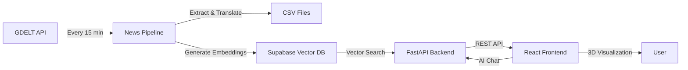

# What's Poppin' 🌍

A real-time global news intelligence platform that combines **GDELT news ingestion**, **AI-powered semantic search**, and an **interactive 3D globe visualization** to explore what's happening around the world.

## 🎯 Project Overview

This project consists of three integrated components:

1. **News Pipeline** - Automatically downloads and processes global news from GDELT every 15 minutes
2. **Backend Server** - FastAPI server with vector search, AI chat, and metadata unfurling
3. **Frontend** - Interactive React app with 3D globe visualization and chat interface

### How It Works



**Data Flow:**
1. **GDELT Monitoring** - Polls GDELT 2.0 master file lists every minute for new updates
2. **Bulk Download** - Downloads 15-minute batches (~2k-5k articles) as they're released
3. **Processing** - Extracts metadata (themes, locations, entities) and translates non-English titles
4. **Vector Storage** - Generates embeddings and stores in Supabase for semantic search
5. **API Layer** - FastAPI serves news data with fuzzy search correction and AI chat
6. **Visualization** - React frontend displays articles on an interactive 3D globe

---

## 📦 Component 1: News Pipeline

**Location:** `server/news_retrieve.py`

### Features

- ✅ **Dual-Stream Monitoring** - Tracks both English and translation GDELT feeds
- ✅ **Parallel Translation** - Translates non-English titles using Google Translate (10 workers)
- ✅ **Smart Extraction** - Parses themes, locations, coordinates, and metadata from GDELT GKG format
- ✅ **Automatic Ingestion** - Generates embeddings and uploads to Supabase vector database
- ✅ **Dual Output** - Saves both cleaned/translated (`news.csv`) and raw (`news_raw.csv`) versions

### Data Extracted

| Field | Description |
|-------|-------------|
| `date` | Publication timestamp (YYYYMMDDHHMMSS) |
| `source_name` | News outlet (e.g., "cnn.com") |
| `url` | Article URL |
| `title` | Article headline (translated to English if needed) |
| `themes` | Cleaned topic tags (e.g., "Climate Change", "Elections") |
| `location_names` | Geographic locations mentioned |
| `location_countries` | Country codes |
| `first_location_lat/lon` | Coordinates of primary location |

### Running the Pipeline

```bash
# From project root
cd server
python news_retrieve.py
```

**Output:**
- `news.csv` - Cleaned, English-translated articles
- `news_raw.csv` - Original data with raw GDELT codes
- Automatic upload to Supabase vector database

---

## 🚀 Component 2: Backend Server

**Location:** `server/main.py`

### API Endpoints

#### `GET /news`
Semantic search for news articles with fuzzy query correction.

**Parameters:**
- `query` (string) - Search query
- `count` (int, default: 1000) - Max results
- `threshold` (float, default: 0.25) - Similarity threshold
- `enable_fuzzy` (bool, default: true) - Enable spell correction

**Example:**
```bash
curl "http://localhost:8000/news?query=climate%20change&count=50"
```

#### `GET /chat`
Returns top relevant articles for a conversational query.

**Parameters:**
- `query` (string) - User message

**Example:**
```bash
curl "http://localhost:8000/chat?query=What's%20happening%20in%20Europe?"
```

**Returns:** JSON array of top 5 most relevant articles

#### `GET /unfurl`
Metadata extraction for news URLs (Discord-style).

**Parameters:**
- `url` (string) - Article URL

**Returns:** Title, cover image, and summary

### Technologies

- **FastAPI** - High-performance async web framework
- **Supabase** - PostgreSQL with pgvector for semantic search
- **Sentence Transformers** - Local embedding generation (all-MiniLM-L6-v2)
- **newspaper4k** - Article metadata extraction
- **pyspellchecker** - Fuzzy search query correction

### Running the Server

```bash
# Install dependencies
pip install -r requirements.txt

# Start server
cd server
uvicorn main:app --reload

# Server runs on http://localhost:8000
```

---

## 🎨 Component 3: Frontend

**Location:** `frontend/`

### Features

- 🌍 **Interactive 3D Globe** - Built with react-globe.gl and Three.js
- 🔍 **Real-time Search** - Instant semantic search with loading animations
- 💬 **Chat Interface** - Conversational news exploration with relevant article retrieval
- 📍 **Geographic Visualization** - Articles plotted by location with country filtering
- 🎭 **Smooth Animations** - Framer Motion transitions between views
- 🌐 **Auto-Location** - Spins to user's location on load

### Key Components

| Component | Purpose |
|-----------|---------|
| `App.jsx` | Main router, handles view switching and API calls |
| `GlobeView.jsx` | 3D globe with news markers and country selection |
| `ChatView.jsx` | Chat interface with topic suggestions |
| `GlobeViewer.jsx` | Three.js globe rendering and camera controls |
| `NewsCard.jsx` | Article display with image unfurling |

### Running the Frontend

```bash
# Install dependencies
cd frontend
npm install

# Start dev server
npm run dev

# Opens on http://localhost:5173
```

### Tech Stack

- **React 18** - UI framework
- **Vite** - Build tool and dev server
- **react-globe.gl** - 3D globe visualization
- **Three.js** - WebGL rendering
- **Framer Motion** - Animation library
- **TailwindCSS** - Utility-first styling
- **Lucide React** - Icon library

---

## ⚙️ Setup & Configuration

### Prerequisites

- **Python 3.8+** with pip
- **Node.js 18+** with npm
- **Supabase Account** (for vector database)

### Environment Variables

Create a `.env` file in the project root:

```env
# Supabase Configuration
SUPABASE_URL=your_supabase_project_url
SUPABASE_KEY=your_supabase_anon_key
```

### Database Setup

Run the Supabase setup script to create the vector database:

```sql
-- See server/db_handle/supabase_setup.sql
-- Creates 'articles' table with pgvector extension
```

### Full Installation

```bash
# 1. Clone repository
git clone <repository-url>
cd whats_poppin

# 2. Install Python dependencies
pip install -r requirements.txt

# 3. Install frontend dependencies
cd frontend
npm install
cd ..

# 4. Configure environment variables
cp .env.example .env
# Edit .env with your API keys

# 5. Start the news pipeline (optional, for live updates)
python server/news_retrieve.py &

# 6. Start the backend server
cd server
uvicorn main:app --reload &

# 7. Start the frontend
cd ../frontend
npm run dev
```

Visit `http://localhost:5173` to use the app!

---

## 📊 Project Structure

```
whats_poppin/
├── server/
│   ├── main.py                    # FastAPI server
│   ├── news_retrieve.py           # GDELT pipeline
│   ├── fuzzy_search.py            # Spell correction
│   ├── main_functions.py          # Chat logic
│   ├── db_handle/
│   │   ├── supabase_client.py     # Vector DB client
│   │   ├── search_articles.py     # Semantic search
│   │   └── supabase_setup.sql     # Database schema
│   └── model/
│       ├── embed.py               # Embedding generation
│       └── chat.py                # AI chat interface
├── frontend/
│   ├── src/
│   │   ├── App.jsx                # Main app
│   │   ├── components/
│   │   │   ├── GlobeView.jsx      # Globe view
│   │   │   ├── ChatView.jsx       # Chat view
│   │   │   ├── GlobeViewer.jsx    # 3D renderer
│   │   │   └── NewsCard.jsx       # Article cards
│   │   └── index.css              # Styles
│   └── package.json
├── requirements.txt               # Python deps
├── .env                           # API keys
└── README.md                      # This file
```

---

## 🔧 Troubleshooting

**Pipeline not downloading articles?**
- Check internet connection
- Verify GDELT API is accessible: http://data.gdeltproject.org/gdeltv2/masterfilelist.txt

**Vector search returning no results?**
- Ensure Supabase credentials are correct in `.env`
- Check if articles table has data: `SELECT COUNT(*) FROM articles;`
- Verify embeddings are being generated (check console logs)

**Frontend can't connect to backend?**
- Ensure backend is running on port 8000
- Check CORS settings in `server/main.py`
- Verify API endpoint URLs in frontend code

**Translation failing?**
- Google Translate may rate-limit; reduce worker count in `news_retrieve.py`
- Check network connectivity

---

## 📝 License

MIT License - Feel free to use and modify!

---

## 🙏 Acknowledgments

- **GDELT Project** - Global news data
- **Supabase** - Vector database infrastructure
- **Sentence Transformers** - Local embedding models
